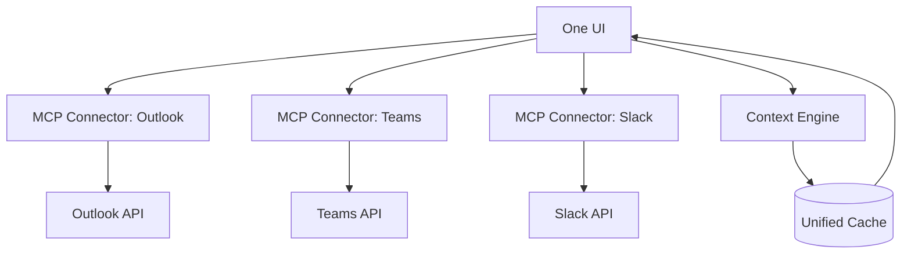

# 🪄 OneUIToConnectThemAll
### *One UI to connect them all.*

> "In the age of scattered communication — one interface to unify them."

---

## 🌍 Over het project
**OneUIToConnectThemAll** is een universele interface die Outlook, Teams, Slack (en andere communicatieplatforms) samenbrengt in één intuïtieve gebruikerservaring.
De app gebruikt **MCP-servers** (Model Context Protocol) om veilig te verbinden met externe platform-API's en alle data centraal te presenteren.

### ✨ Belangrijkste kenmerken
- 🔗 **Multi-platform integratie:** Outlook, Teams, Slack en meer
- 🧠 **AI-gedreven contextbeheer:** automatisch samenvatten, groeperen en filteren van gesprekken
- 🪶 **Eén elegante UI:** minimalistisch design, volledig thematisch aanpasbaar
- ⚙️ **Gebouwd op MCP:** veilige connectie tussen model-agents en externe services
- 📡 **Extensibel:** gemakkelijk uit te breiden met nieuwe connectoren of UI-modules

---

## 🧩 Architectuur


**Hoe het werkt:**
1. **One UI** communiceert via MCP-connectoren met verschillende platforms
2. **MCP-servers** handelen authenticatie en API-aanroepen af
3. **Context Engine** verwerkt en analyseert berichten met AI
4. **Unified Cache** slaat data lokaal op voor snelle toegang
5. Alle informatie wordt gepresenteerd in één consistente interface

---

## 🛠️ Tech Stack

### Frontend
- **Framework:** Next.js 14 with App Router
- **UI Library:** Tailwind CSS + Shadcn/ui
- **State Management:** Zustand with persistence
- **Theming:** Custom theme engine met dark/light mode

### Backend & Integration
- **MCP Protocol:** Model Context Protocol voor platform-integratie
- **API Clients:** Microsoft Graph API, Slack API, Teams API
- **Authentication:** OAuth 2.0 voor alle platforms
- **Caching:** Redis of lokale database (SQLite/PostgreSQL)

### AI & Context
- **AI Models:** Claude API of lokale LLM's
- **Context Processing:** LangChain voor conversatie-analyse
- **Embeddings:** Voor semantisch zoeken en groeperen

---

## 📊 Project Status

✅ **Status:** Phase 2 Complete - Core Features Ready

### Roadmap

#### Phase 1: Foundation (Q1 2025) ✅
- [x] Setup project architectuur
- [x] Implementeer basis UI framework
- [x] Ontwikkel eerste MCP-connector (Slack)
- [x] Basis authenticatie systeem

#### Phase 2: Core Features (Q2 2025) ✅
- [x] Outlook & Teams MCP-connectoren
- [x] Context Engine met AI-integratie
- [x] Unified messaging interface
- [x] Zoek- en filterfunctionaliteit

#### Phase 3: Enhancement (Q3 2025)
- [ ] Geavanceerde AI-features (samenvatten, prioriteren)
- [ ] Custom themes en personalisatie
- [ ] Notificatie systeem
- [ ] Performance optimalisatie

#### Phase 4: Extension (Q4 2025)
- [ ] Plugin systeem voor nieuwe connectoren
- [ ] Mobile companion app
- [ ] Enterprise features
- [ ] Community marketplace

---

## 🚀 Getting Started

### Prerequisites

Om met dit project te werken heb je nodig:
- **Node.js** (v18 of hoger)
- **npm** of **pnpm**
- **Git**
- **mkcert** (voor lokale HTTPS certificaten - [installatie instructies](https://github.com/FiloSottile/mkcert#installation))
- API-toegang tot de platforms die je wilt integreren:
  - Slack workspace met admin rechten (vereist voor Phase 1)
  - Microsoft 365 account (voor Outlook/Teams - Phase 2)
  - Claude API key (optioneel, voor AI-features - Phase 3)

> ⚠️ **Belangrijk:** Slack vereist HTTPS voor OAuth. We gebruiken mkcert voor lokale HTTPS ontwikkeling!

### Installatie

```bash
# Clone de repository
git clone https://github.com/Xiliath/OneUIToConnectThemAll.git
cd OneUIToConnectThemAll

# Installeer dependencies
npm install

# Setup HTTPS certificaten voor lokale ontwikkeling
# macOS/Linux:
npm run setup-https

# Windows:
npm run setup-https:windows

# Copy environment variabelen
cp .env.example .env

# Configureer je API keys in .env
# SLACK_CLIENT_ID=your_slack_client_id
# SLACK_CLIENT_SECRET=your_slack_client_secret
# SLACK_SIGNING_SECRET=your_slack_signing_secret
# SLACK_REDIRECT_URI=https://localhost:3000/api/auth/slack/callback
# NEXT_PUBLIC_APP_URL=https://localhost:3000

# Start development server (nu met HTTPS!)
npm run dev
```

De applicatie is nu beschikbaar op [https://localhost:3000](https://localhost:3000)

**Note:** De `setup-https` script installeert mkcert en genereert lokale SSL certificaten. Je browser zal deze automatisch vertrouwen!

### Slack App Setup

Om Slack te integreren heb je een Slack App nodig:

#### Stap 1: Configureer Slack App

1. Ga naar [https://api.slack.com/apps](https://api.slack.com/apps)
2. Klik op "Create New App" en kies "From scratch"
3. Geef je app een naam en selecteer je workspace
4. Ga naar "OAuth & Permissions" en voeg deze scopes toe onder **User Token Scopes**:
   - `channels:history`
   - `channels:read`
   - `chat:write`
   - `users:read`
   - `groups:read`
   - `groups:history`
5. Voeg de redirect URL toe: `https://localhost:3000/api/auth/slack/callback`
   - ⚠️ **Belangrijk:** Gebruik exact `https://localhost:3000`, niet `http://`!
6. Kopieer je **Client ID**, **Client Secret**, en **Signing Secret** naar je `.env` bestand

#### Stap 2: Test de integratie

1. Zorg dat je HTTPS certificaten zijn gegenereerd: `npm run setup-https`
2. Start de development server: `npm run dev`
3. Ga naar [https://localhost:3000](https://localhost:3000)
4. Klik op "Go to Dashboard"
5. Klik op "Connect Slack"
6. Autoriseer de app in je Slack workspace
7. Je wordt teruggeleid naar het dashboard waar je channels kunt zien

**Note:** Je browser zal de HTTPS verbinding vertrouwen omdat mkcert een lokale CA installeert!

---

### Microsoft Teams & Outlook Setup (Phase 2)

Om Teams en Outlook te integreren heb je een Microsoft Azure App Registration nodig:

#### Stap 1: Maak een Azure App Registration

1. Ga naar [Azure Portal](https://portal.azure.com/)
2. Navigeer naar **Azure Active Directory** > **App registrations**
3. Klik op **New registration**
4. Vul de volgende gegevens in:
   - **Name:** OneUI (of een andere naam naar keuze)
   - **Supported account types:** Accounts in any organizational directory and personal Microsoft accounts
   - **Redirect URI:**
     - Platform: **Web**
     - URI: `https://localhost:3000/api/auth/microsoft/callback`
5. Klik op **Register**

#### Stap 2: Configureer API Permissions

1. Ga naar **API permissions** in je app registration
2. Klik op **Add a permission**
3. Selecteer **Microsoft Graph**
4. Kies **Delegated permissions** en voeg toe:

   **Voor Teams:**
   - `User.Read`
   - `Chat.Read`
   - `Chat.ReadWrite`
   - `ChannelMessage.Read.All`
   - `Team.ReadBasic.All`
   - `Channel.ReadBasic.All`

   **Voor Outlook:**
   - `User.Read`
   - `Mail.Read`
   - `Mail.ReadWrite`
   - `Mail.Send`
   - `MailboxSettings.Read`

5. Klik op **Add permissions**
6. Klik op **Grant admin consent** (optioneel maar aanbevolen voor testen)

#### Stap 3: Genereer Client Secret

1. Ga naar **Certificates & secrets**
2. Klik op **New client secret**
3. Geef een beschrijving (bijv. "OneUI Development")
4. Kies een expiration period (6 months, 12 months, of 24 months)
5. Klik op **Add**
6. **⚠️ Belangrijk:** Kopieer de **Value** direct! Deze wordt later niet meer getoond

#### Stap 4: Configureer Environment Variables

Voeg de volgende variabelen toe aan je `.env` bestand:

```env
# Microsoft Configuration
MICROSOFT_CLIENT_ID=your_application_client_id
MICROSOFT_CLIENT_SECRET=your_client_secret_value
MICROSOFT_REDIRECT_URI=https://localhost:3000/api/auth/microsoft/callback
```

Je kunt de **Client ID** (Application ID) vinden op de Overview pagina van je app registration.

#### Stap 5: Test de integratie

1. Start de development server: `npm run dev`
2. Ga naar [https://localhost:3000/dashboard](https://localhost:3000/dashboard)
3. Klik op **Teams** of **Outlook** onder "Platforms"
4. Log in met je Microsoft account
5. Accepteer de gevraagde permissions
6. Je wordt teruggeleid naar het dashboard waar je je Teams channels of Outlook folders ziet

**Tips:**
- Voor Teams: Je ziet alleen teams waar je lid van bent
- Voor Outlook: Je ziet je mail folders (Inbox, Sent Items, etc.)
- Je kunt meerdere platforms tegelijk verbinden!

---

### AI Features Setup (Phase 2)

Om AI-powered features te gebruiken (zoals message summarization):

#### Stap 1: Verkrijg Claude API Key

1. Ga naar [Anthropic Console](https://console.anthropic.com/)
2. Maak een account aan of log in
3. Navigeer naar **API Keys**
4. Klik op **Create Key**
5. Geef je key een naam (bijv. "OneUI Development")
6. Kopieer de API key

#### Stap 2: Configureer Environment Variable

Voeg toe aan je `.env` bestand:

```env
# Claude API (voor AI features)
CLAUDE_API_KEY=sk-ant-api03-...your-api-key
```

#### Stap 3: Gebruik AI Features

1. Selecteer een channel met berichten in het dashboard
2. Klik op de **AI Summary** knop (met ✨ icoon)
3. Wacht terwijl de AI een samenvatting genereert
4. De samenvatting verschijnt in een popup

**AI Features:**
- **Message Summarization:** Vat conversatie threads samen
- **Smart Search:** Zoek door alle berichten van alle platforms tegelijk
- **Platform Filtering:** Filter berichten per platform
- **Sort & Organize:** Sorteer berichten op datum

**Note:** AI features vereisen een werkende Claude API key. Zonder API key kun je nog steeds alle andere features gebruiken, maar de AI Summary knop zal een foutmelding geven.

---

### Project Structuur

```
OneUIToConnectThemAll/
├── app/                    # Next.js App Router
│   ├── api/               # API routes
│   │   └── auth/         # OAuth handlers
│   ├── dashboard/        # Dashboard page
│   ├── globals.css       # Global styles
│   ├── layout.tsx        # Root layout
│   └── page.tsx          # Home page
├── components/            # React components
│   ├── ui/               # UI components (Button, Card, etc.)
│   ├── message-list.tsx  # Message display
│   └── sidebar.tsx       # Channel sidebar
├── lib/                   # Utilities
│   ├── store.ts          # Zustand state management
│   └── utils.ts          # Helper functions
├── services/              # Business logic
│   ├── auth/             # OAuth service
│   └── mcp/              # MCP connectors
├── types/                 # TypeScript types
│   └── index.ts          # Type definitions
└── __tests__/            # Jest tests
```

---

## 💡 Usage

### Quick Start Guide

1. **Start de development server:**
   ```bash
   npm run dev
   ```

2. **Open de applicatie:**
   - Ga naar [https://localhost:3000](https://localhost:3000)
   - Klik op "Go to Dashboard"

3. **Verbind je platforms:**
   - **Slack:** Klik op "Slack" button, autoriseer in je workspace
   - **Teams:** Klik op "Teams" button, log in met Microsoft account
   - **Outlook:** Klik op "Outlook" button, log in met Microsoft account

4. **Gebruik de unified interface:**
   - Selecteer een channel/folder uit de sidebar
   - Bekijk berichten van alle platforms in één interface
   - Gebruik de zoekbalk om door alle berichten te zoeken
   - Filter op platform met de dropdown
   - Klik op "AI Summary" voor een AI-gegenereerde samenvatting

### Phase 2 Features (Current)

**Multi-Platform Integration:**
- Connect Slack, Microsoft Teams, en Outlook
- Bekijk alle channels en folders in één sidebar
- Switch naadloos tussen platforms

**Unified Messaging:**
- Alle berichten in één consistent format
- Real-time search door alle platforms
- Filter op platform, sorteer op datum
- Zie metadata zoals author, timestamp, en platform badge

**AI-Powered Features:**
- Automatische message summarization
- Context-aware analysis
- Smart search en filtering

**Hoe te gebruiken:**
```javascript
// Berichten van alle platforms worden automatisch samengevoegd
// Gebruik de search bar om te zoeken:
"bug fix" // Zoekt in alle berichten van alle platforms

// Filter op specifiek platform via dropdown
// Sorteer op "Newest First" of "Oldest First"
```

### Development

```bash
# Run development server
npm run dev

# Build for production
npm run build

# Start production server
npm start

# Run tests
npm test

# Run tests in watch mode
npm run test:watch

# Lint code
npm run lint
```

### Gebruik van de MCP Connectors

```typescript
import { slackConnector } from '@/services/mcp'

// Connect to Slack
slackConnector.setAccessToken('your-access-token')
await slackConnector.connect()

// Get channels
const channels = await slackConnector.getChannels()

// Get messages
const messages = await slackConnector.getMessages('channel-id', 50)

// Send message
const newMessage = await slackConnector.sendMessage('channel-id', 'Hello!')
```

### Geplande functionaliteit (Phase 2+):

```javascript
// Voorbeeld: Berichten ophalen van alle platforms
const messages = await oneUI.getUnifiedMessages({
  platforms: ['slack', 'teams', 'outlook'],
  timeRange: 'today',
  filter: 'unread'
});

// Voorbeeld: AI-samenvatting van conversaties
const summary = await oneUI.summarizeThread(threadId, {
  maxLength: 200,
  style: 'concise'
});
```

---

## 🔧 Troubleshooting

### HTTPS Certificate Issues

**Problem:** Browser shows "Your connection is not private"
- **Oplossing:** Run `npm run setup-https` om mkcert te installeren en certificaten te genereren
- Controleer of mkcert correct is geïnstalleerd: `mkcert -version`
- Run `mkcert -install` om de lokale CA te installeren
- Herstart je browser na het installeren van de CA

**Problem:** "ENOENT: no such file or directory" error bij het starten
- **Oplossing:** Je hebt de HTTPS certificaten nog niet gegenereerd
- Run `npm run setup-https` (macOS/Linux) of `npm run setup-https:windows` (Windows)
- Controleer of de files bestaan in de `certificates/` directory

**Problem:** mkcert command not found
- **Oplossing:** Installeer mkcert:
  - **macOS:** `brew install mkcert`
  - **Linux:** Zie [mkcert installation guide](https://github.com/FiloSottile/mkcert#linux)
  - **Windows:** `choco install mkcert` of `scoop install mkcert`

### Slack OAuth Issues

**Problem:** "The redirect_uri is invalid"
- **Oplossing:** Controleer of je exact `https://localhost:3000/api/auth/slack/callback` hebt gebruikt
- Zorg dat je HTTPS gebruikt, niet HTTP
- Herstart je Next.js server na het wijzigen van `.env`

**Problem:** OAuth callback werkt niet
- **Oplossing:**
  - Zorg dat `NEXT_PUBLIC_APP_URL` in `.env` is ingesteld op `https://localhost:3000`
  - Controleer de browser console en server logs voor errors
  - Verifieer dat je development server draait op `https://localhost:3000`

**Problem:** "Can't connect" of "SSL protocol error"
- **Oplossing:**
  - Controleer of de certificaten correct zijn gegenereerd in `certificates/`
  - Herstart je development server
  - Probeer je browser cache te wissen

### Voor Production

Voor production deployments (Vercel, Netlify, etc.):
- Gebruik je productie domein HTTPS URL
- Update de redirect URI in je Slack app configuratie naar je productie URL
- Update `NEXT_PUBLIC_APP_URL` in je environment variabelen
- Je hebt geen mkcert certificaten nodig in productie (de hosting provider regelt HTTPS)

---

## 🤝 Contributing

Bijdragen zijn van harte welkom! Dit project is nog in de vroege fase en er is veel ruimte voor input.

### Hoe bij te dragen:

1. **Fork** de repository
2. **Create** een feature branch (`git checkout -b feature/AmazingFeature`)
3. **Commit** je changes (`git commit -m 'Add some AmazingFeature'`)
4. **Push** naar de branch (`git push origin feature/AmazingFeature`)
5. **Open** een Pull Request

### Development Guidelines

- Volg de bestaande code style
- Schrijf duidelijke commit messages
- Update documentatie waar nodig
- Test je code grondig
- Respecteer de privacy en security best practices

### Gebieden waar hulp welkom is:

- 🔌 MCP-connector ontwikkeling
- 🎨 UI/UX design
- 🧠 AI/ML integratie
- 📚 Documentatie
- 🧪 Testing & QA
- 🌍 Internationalisatie

---

## 📜 License

Dit project is gelicenseerd onder de MIT License - zie het [LICENSE](LICENSE) bestand voor details.

---

## 👤 Author

**Pascal van Oostenbrugge**

- GitHub: [@Xiliath](https://github.com/Xiliath)

---

## 🙏 Acknowledgments

- Bedankt aan het [Model Context Protocol](https://modelcontextprotocol.io/) team voor het protocol
- Geïnspireerd door de behoefte aan een uniforme communicatie-ervaring
- Alle toekomstige contributors en early adopters

---

## 📬 Contact & Support

- **Issues:** [GitHub Issues](https://github.com/Xiliath/OneUIToConnectThemAll/issues)
- **Discussions:** [GitHub Discussions](https://github.com/Xiliath/OneUIToConnectThemAll/discussions)

---

<div align="center">

**⚡ Built with passion for unified communication**

*Star ⭐ dit project als je het interessant vindt!*

</div>
