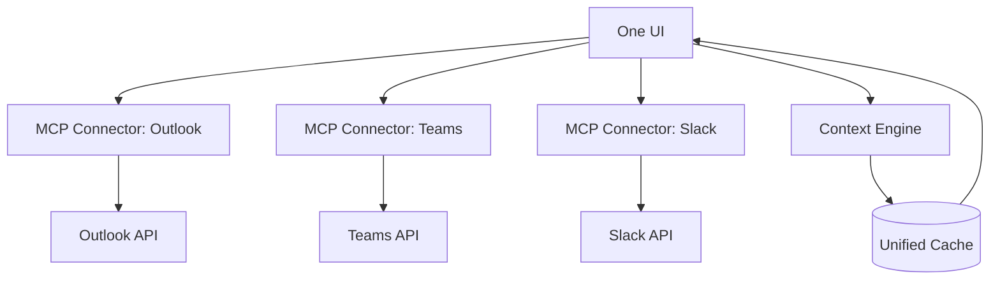

# 🪄 OneUIToConnectThemAll
### *One UI to connect them all.*

> "In the age of scattered communication — one interface to unify them."

---

## 🌍 Over het project
**OneUIToConnectThemAll** is een universele interface die Outlook, Teams, Slack (en andere communicatieplatforms) samenbrengt in één intuïtieve gebruikerservaring.
De app gebruikt **MCP-servers** (Model Context Protocol) om veilig te verbinden met externe platform-API's en alle data centraal te presenteren.

### ✨ Belangrijkste kenmerken
- 🔗 **Multi-platform integratie:** Outlook, Teams, Slack en meer
- 🧠 **AI-gedreven contextbeheer:** automatisch samenvatten, groeperen en filteren van gesprekken
- 🪶 **Eén elegante UI:** minimalistisch design, volledig thematisch aanpasbaar
- ⚙️ **Gebouwd op MCP:** veilige connectie tussen model-agents en externe services
- 📡 **Extensibel:** gemakkelijk uit te breiden met nieuwe connectoren of UI-modules

---

## 🧩 Architectuur


**Hoe het werkt:**
1. **One UI** communiceert via MCP-connectoren met verschillende platforms
2. **MCP-servers** handelen authenticatie en API-aanroepen af
3. **Context Engine** verwerkt en analyseert berichten met AI
4. **Unified Cache** slaat data lokaal op voor snelle toegang
5. Alle informatie wordt gepresenteerd in één consistente interface

---

## 🛠️ Tech Stack

### Frontend
- **Framework:** Next.js 14 with App Router
- **UI Library:** Tailwind CSS + Shadcn/ui
- **State Management:** Zustand with persistence
- **Theming:** Custom theme engine met dark/light mode

### Backend & Integration
- **MCP Protocol:** Model Context Protocol voor platform-integratie
- **API Clients:** Microsoft Graph API, Slack API, Teams API
- **Authentication:** OAuth 2.0 voor alle platforms
- **Caching:** Redis of lokale database (SQLite/PostgreSQL)

### AI & Context
- **AI Models:** Claude API of lokale LLM's
- **Context Processing:** LangChain voor conversatie-analyse
- **Embeddings:** Voor semantisch zoeken en groeperen

---

## 📊 Project Status

✅ **Status:** Phase 1 Complete - Foundation Ready

### Roadmap

#### Phase 1: Foundation (Q1 2025) ✅
- [x] Setup project architectuur
- [x] Implementeer basis UI framework
- [x] Ontwikkel eerste MCP-connector (Slack)
- [x] Basis authenticatie systeem

#### Phase 2: Core Features (Q2 2025)
- [ ] Outlook & Teams MCP-connectoren
- [ ] Context Engine met AI-integratie
- [ ] Unified messaging interface
- [ ] Zoek- en filterfunctionaliteit

#### Phase 3: Enhancement (Q3 2025)
- [ ] Geavanceerde AI-features (samenvatten, prioriteren)
- [ ] Custom themes en personalisatie
- [ ] Notificatie systeem
- [ ] Performance optimalisatie

#### Phase 4: Extension (Q4 2025)
- [ ] Plugin systeem voor nieuwe connectoren
- [ ] Mobile companion app
- [ ] Enterprise features
- [ ] Community marketplace

---

## 🚀 Getting Started

### Prerequisites

Om met dit project te werken heb je nodig:
- **Node.js** (v18 of hoger)
- **npm** of **pnpm**
- **Git**
- **ngrok** (voor lokale Slack OAuth - [download hier](https://ngrok.com/download))
- API-toegang tot de platforms die je wilt integreren:
  - Slack workspace met admin rechten (vereist voor Phase 1)
  - Microsoft 365 account (voor Outlook/Teams - Phase 2)
  - Claude API key (optioneel, voor AI-features - Phase 3)

> ⚠️ **Belangrijk:** Slack vereist HTTPS voor OAuth. Gebruik ngrok voor lokale ontwikkeling!

### Installatie

```bash
# Clone de repository
git clone https://github.com/Xiliath/OneUIToConnectThemAll.git
cd OneUIToConnectThemAll

# Installeer dependencies
npm install

# Copy environment variabelen
cp .env.example .env

# Configureer je API keys in .env
# SLACK_CLIENT_ID=your_slack_client_id
# SLACK_CLIENT_SECRET=your_slack_client_secret
# SLACK_SIGNING_SECRET=your_slack_signing_secret
# SLACK_REDIRECT_URI=https://your-ngrok-url.ngrok.io/api/auth/slack/callback
# NEXT_PUBLIC_APP_URL=https://your-ngrok-url.ngrok.io

# Start development server
npm run dev

# In een andere terminal, start ngrok (voor Slack OAuth)
npx ngrok http 3000
```

**Note:** Voor lokale ontwikkeling met Slack OAuth moet je ngrok gebruiken omdat Slack HTTPS vereist voor redirect URLs. Zie de "Slack App Setup" sectie hieronder voor meer details.

### Slack App Setup

Om Slack te integreren heb je een Slack App nodig:

**Belangrijke Note:** Slack vereist HTTPS voor OAuth redirect URLs. Voor lokale ontwikkeling moet je een tunneling service zoals ngrok gebruiken.

#### Stap 1: Setup ngrok (voor local development)

```bash
# Installeer ngrok (https://ngrok.com/)
# Start je Next.js app
npm run dev

# In een nieuwe terminal, start ngrok
ngrok http 3000

# Ngrok geeft je een HTTPS URL, bijvoorbeeld: https://abc123.ngrok.io
# Gebruik deze URL in de volgende stappen
```

#### Stap 2: Configureer Slack App

1. Ga naar [https://api.slack.com/apps](https://api.slack.com/apps)
2. Klik op "Create New App" en kies "From scratch"
3. Geef je app een naam en selecteer je workspace
4. Ga naar "OAuth & Permissions" en voeg deze scopes toe onder **User Token Scopes**:
   - `channels:history`
   - `channels:read`
   - `chat:write`
   - `users:read`
   - `groups:read`
   - `groups:history`
5. Voeg de redirect URL toe: `https://your-ngrok-url.ngrok.io/api/auth/slack/callback`
   - ⚠️ **Belangrijk:** Gebruik HTTPS, niet HTTP!
   - Vervang `your-ngrok-url.ngrok.io` met je echte ngrok URL
6. Kopieer je **Client ID**, **Client Secret**, en **Signing Secret** naar je `.env` bestand
7. Update `SLACK_REDIRECT_URI` en `NEXT_PUBLIC_APP_URL` in `.env` met je ngrok URL
8. Herstart je Next.js server om de nieuwe environment variabelen te laden

#### Stap 3: Test de integratie

1. Ga naar je ngrok URL (bijv. `https://abc123.ngrok.io`)
2. Klik op "Go to Dashboard"
3. Klik op "Connect Slack"
4. Autoriseer de app in je Slack workspace
5. Je wordt teruggeleid naar het dashboard waar je channels kunt zien

### Project Structuur

```
OneUIToConnectThemAll/
├── app/                    # Next.js App Router
│   ├── api/               # API routes
│   │   └── auth/         # OAuth handlers
│   ├── dashboard/        # Dashboard page
│   ├── globals.css       # Global styles
│   ├── layout.tsx        # Root layout
│   └── page.tsx          # Home page
├── components/            # React components
│   ├── ui/               # UI components (Button, Card, etc.)
│   ├── message-list.tsx  # Message display
│   └── sidebar.tsx       # Channel sidebar
├── lib/                   # Utilities
│   ├── store.ts          # Zustand state management
│   └── utils.ts          # Helper functions
├── services/              # Business logic
│   ├── auth/             # OAuth service
│   └── mcp/              # MCP connectors
├── types/                 # TypeScript types
│   └── index.ts          # Type definitions
└── __tests__/            # Jest tests
```

---

## 💡 Usage

### Phase 1 Features

**Slack Integration:**
1. Start de development server met `npm run dev`
2. Ga naar [http://localhost:3000](http://localhost:3000)
3. Klik op "Go to Dashboard"
4. Klik op "Connect Slack"
5. Autoriseer de app in je Slack workspace
6. Bekijk je channels en berichten in de unified interface

### Development

```bash
# Run development server
npm run dev

# Build for production
npm run build

# Start production server
npm start

# Run tests
npm test

# Run tests in watch mode
npm run test:watch

# Lint code
npm run lint
```

### Gebruik van de MCP Connectors

```typescript
import { slackConnector } from '@/services/mcp'

// Connect to Slack
slackConnector.setAccessToken('your-access-token')
await slackConnector.connect()

// Get channels
const channels = await slackConnector.getChannels()

// Get messages
const messages = await slackConnector.getMessages('channel-id', 50)

// Send message
const newMessage = await slackConnector.sendMessage('channel-id', 'Hello!')
```

### Geplande functionaliteit (Phase 2+):

```javascript
// Voorbeeld: Berichten ophalen van alle platforms
const messages = await oneUI.getUnifiedMessages({
  platforms: ['slack', 'teams', 'outlook'],
  timeRange: 'today',
  filter: 'unread'
});

// Voorbeeld: AI-samenvatting van conversaties
const summary = await oneUI.summarizeThread(threadId, {
  maxLength: 200,
  style: 'concise'
});
```

---

## 🔧 Troubleshooting

### Slack OAuth Issues

**Problem:** "The redirect_uri is invalid"
- **Oplossing:** Controleer of je HTTPS gebruikt in je redirect URI (niet HTTP)
- Zorg dat je ngrok URL exact overeenkomt met wat je in Slack hebt geconfigureerd
- Herstart je Next.js server na het wijzigen van `.env`

**Problem:** OAuth callback werkt niet
- **Oplossing:** Controleer of ngrok nog actief is (ngrok sessies verlopen na een tijdje in de gratis versie)
- Zorg dat `NEXT_PUBLIC_APP_URL` in `.env` overeenkomt met je ngrok URL
- Controleer de browser console en server logs voor errors

**Problem:** "This site can't be reached" bij ngrok URL
- **Oplossing:** Zorg dat beide servers draaien:
  - Terminal 1: `npm run dev` (Next.js server op poort 3000)
  - Terminal 2: `ngrok http 3000` (ngrok tunnel)

**Problem:** CORS errors
- **Oplossing:** Ngrok's gratis tier kan soms CORS issues veroorzaken. Probeer:
  - Je ngrok sessie opnieuw te starten
  - Een andere ngrok URL te gebruiken
  - Je browser cache te wissen

### Voor Production

Voor production deployments (Vercel, Netlify, etc.):
- Gebruik je productie domein in plaats van ngrok
- Zorg dat je domein HTTPS ondersteunt
- Update de redirect URI in je Slack app configuratie
- Update `NEXT_PUBLIC_APP_URL` in je environment variabelen

---

## 🤝 Contributing

Bijdragen zijn van harte welkom! Dit project is nog in de vroege fase en er is veel ruimte voor input.

### Hoe bij te dragen:

1. **Fork** de repository
2. **Create** een feature branch (`git checkout -b feature/AmazingFeature`)
3. **Commit** je changes (`git commit -m 'Add some AmazingFeature'`)
4. **Push** naar de branch (`git push origin feature/AmazingFeature`)
5. **Open** een Pull Request

### Development Guidelines

- Volg de bestaande code style
- Schrijf duidelijke commit messages
- Update documentatie waar nodig
- Test je code grondig
- Respecteer de privacy en security best practices

### Gebieden waar hulp welkom is:

- 🔌 MCP-connector ontwikkeling
- 🎨 UI/UX design
- 🧠 AI/ML integratie
- 📚 Documentatie
- 🧪 Testing & QA
- 🌍 Internationalisatie

---

## 📜 License

Dit project is gelicenseerd onder de MIT License - zie het [LICENSE](LICENSE) bestand voor details.

---

## 👤 Author

**Pascal van Oostenbrugge**

- GitHub: [@Xiliath](https://github.com/Xiliath)

---

## 🙏 Acknowledgments

- Bedankt aan het [Model Context Protocol](https://modelcontextprotocol.io/) team voor het protocol
- Geïnspireerd door de behoefte aan een uniforme communicatie-ervaring
- Alle toekomstige contributors en early adopters

---

## 📬 Contact & Support

- **Issues:** [GitHub Issues](https://github.com/Xiliath/OneUIToConnectThemAll/issues)
- **Discussions:** [GitHub Discussions](https://github.com/Xiliath/OneUIToConnectThemAll/discussions)

---

<div align="center">

**⚡ Built with passion for unified communication**

*Star ⭐ dit project als je het interessant vindt!*

</div>
