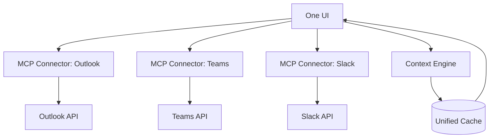

# 🪄 OneUIToConnectThemAll
### *One UI to connect them all.*

> "In the age of scattered communication — one interface to unify them."

---

## 🌍 Over het project
**OneUIToConnectThemAll** is een universele interface die Outlook, Teams, Slack (en andere communicatieplatforms) samenbrengt in één intuïtieve gebruikerservaring.
De app gebruikt **MCP-servers** (Model Context Protocol) om veilig te verbinden met externe platform-API's en alle data centraal te presenteren.

### ✨ Belangrijkste kenmerken
- 🔗 **Multi-platform integratie:** Outlook, Teams, Slack en meer
- 🧠 **AI-gedreven contextbeheer:** automatisch samenvatten, groeperen en filteren van gesprekken
- 🪶 **Eén elegante UI:** minimalistisch design, volledig thematisch aanpasbaar
- ⚙️ **Gebouwd op MCP:** veilige connectie tussen model-agents en externe services
- 📡 **Extensibel:** gemakkelijk uit te breiden met nieuwe connectoren of UI-modules

---

## 🧩 Architectuur


**Hoe het werkt:**
1. **One UI** communiceert via MCP-connectoren met verschillende platforms
2. **MCP-servers** handelen authenticatie en API-aanroepen af
3. **Context Engine** verwerkt en analyseert berichten met AI
4. **Unified Cache** slaat data lokaal op voor snelle toegang
5. Alle informatie wordt gepresenteerd in één consistente interface

---

## 🛠️ Tech Stack

### Frontend
- **Framework:** React/Next.js of Electron (te bepalen)
- **UI Library:** Tailwind CSS + Shadcn/ui
- **State Management:** Zustand of Redux Toolkit
- **Theming:** Custom theme engine met dark/light mode

### Backend & Integration
- **MCP Protocol:** Model Context Protocol voor platform-integratie
- **API Clients:** Microsoft Graph API, Slack API, Teams API
- **Authentication:** OAuth 2.0 voor alle platforms
- **Caching:** Redis of lokale database (SQLite/PostgreSQL)

### AI & Context
- **AI Models:** Claude API of lokale LLM's
- **Context Processing:** LangChain voor conversatie-analyse
- **Embeddings:** Voor semantisch zoeken en groeperen

---

## 📊 Project Status

🚧 **Status:** Early Development / Concept Phase

### Roadmap

#### Phase 1: Foundation (Q1 2025)
- [ ] Setup project architectuur
- [ ] Implementeer basis UI framework
- [ ] Ontwikkel eerste MCP-connector (Slack)
- [ ] Basis authenticatie systeem

#### Phase 2: Core Features (Q2 2025)
- [ ] Outlook & Teams MCP-connectoren
- [ ] Context Engine met AI-integratie
- [ ] Unified messaging interface
- [ ] Zoek- en filterfunctionaliteit

#### Phase 3: Enhancement (Q3 2025)
- [ ] Geavanceerde AI-features (samenvatten, prioriteren)
- [ ] Custom themes en personalisatie
- [ ] Notificatie systeem
- [ ] Performance optimalisatie

#### Phase 4: Extension (Q4 2025)
- [ ] Plugin systeem voor nieuwe connectoren
- [ ] Mobile companion app
- [ ] Enterprise features
- [ ] Community marketplace

---

## 🚀 Getting Started

### Prerequisites

Om met dit project te werken heb je nodig:
- **Node.js** (v18 of hoger)
- **npm** of **pnpm**
- **Git**
- API-toegang tot de platforms die je wilt integreren:
  - Microsoft 365 account (voor Outlook/Teams)
  - Slack workspace met admin rechten
  - Claude API key (optioneel, voor AI-features)

### Installatie

> **Note:** Dit project is nog in de concept fase. Onderstaande instructies zijn voorbereid voor toekomstige implementatie.

```bash
# Clone de repository
git clone https://github.com/Xiliath/OneUIToConnectThemAll.git
cd OneUIToConnectThemAll

# Installeer dependencies
npm install

# Copy environment variabelen
cp .env.example .env

# Configureer je API keys in .env
# SLACK_CLIENT_ID=your_slack_client_id
# SLACK_CLIENT_SECRET=your_slack_client_secret
# MICROSOFT_CLIENT_ID=your_microsoft_client_id
# MICROSOFT_CLIENT_SECRET=your_microsoft_client_secret
# CLAUDE_API_KEY=your_claude_api_key

# Start development server
npm run dev
```

---

## 💡 Usage

> **Note:** Gebruik voorbeelden worden toegevoegd zodra de eerste implementatie gereed is.

### Geplande functionaliteit:

```javascript
// Voorbeeld: Berichten ophalen van alle platforms
const messages = await oneUI.getUnifiedMessages({
  platforms: ['slack', 'teams', 'outlook'],
  timeRange: 'today',
  filter: 'unread'
});

// Voorbeeld: AI-samenvatting van conversaties
const summary = await oneUI.summarizeThread(threadId, {
  maxLength: 200,
  style: 'concise'
});
```

---

## 🤝 Contributing

Bijdragen zijn van harte welkom! Dit project is nog in de vroege fase en er is veel ruimte voor input.

### Hoe bij te dragen:

1. **Fork** de repository
2. **Create** een feature branch (`git checkout -b feature/AmazingFeature`)
3. **Commit** je changes (`git commit -m 'Add some AmazingFeature'`)
4. **Push** naar de branch (`git push origin feature/AmazingFeature`)
5. **Open** een Pull Request

### Development Guidelines

- Volg de bestaande code style
- Schrijf duidelijke commit messages
- Update documentatie waar nodig
- Test je code grondig
- Respecteer de privacy en security best practices

### Gebieden waar hulp welkom is:

- 🔌 MCP-connector ontwikkeling
- 🎨 UI/UX design
- 🧠 AI/ML integratie
- 📚 Documentatie
- 🧪 Testing & QA
- 🌍 Internationalisatie

---

## 📜 License

Dit project is gelicenseerd onder de MIT License - zie het [LICENSE](LICENSE) bestand voor details.

---

## 👤 Author

**Pascal van Oostenbrugge**

- GitHub: [@Xiliath](https://github.com/Xiliath)

---

## 🙏 Acknowledgments

- Bedankt aan het [Model Context Protocol](https://modelcontextprotocol.io/) team voor het protocol
- Geïnspireerd door de behoefte aan een uniforme communicatie-ervaring
- Alle toekomstige contributors en early adopters

---

## 📬 Contact & Support

- **Issues:** [GitHub Issues](https://github.com/Xiliath/OneUIToConnectThemAll/issues)
- **Discussions:** [GitHub Discussions](https://github.com/Xiliath/OneUIToConnectThemAll/discussions)

---

<div align="center">

**⚡ Built with passion for unified communication**

*Star ⭐ dit project als je het interessant vindt!*

</div>
